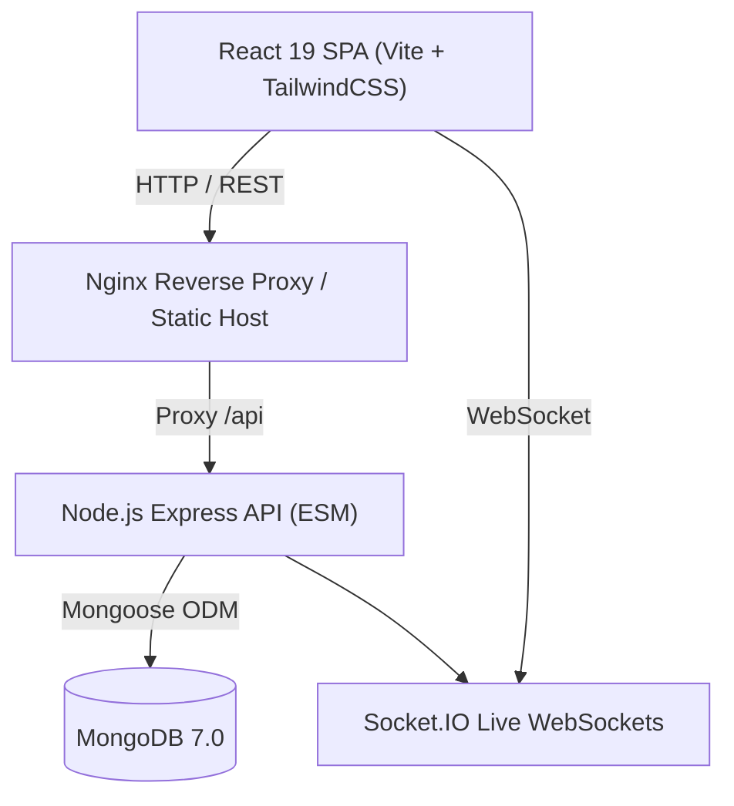

# 🌿 Shanthi Ayurvedas — Enterprise MERN CRM & ERP

A high-performance, enterprise-grade Ayurveda Clinic & Multi-Branch E-Commerce CRM built with **Node.js (ESM)**, **Express**, **MongoDB**, **React 19**, **Vite**, and **TailwindCSS**.

---

## 📋 Table of Contents
- [Architecture & Tech Stack](#-architecture--tech-stack)
- [Project Directory Structure](#-project-directory-structure)
- [Key Modules & Capabilities](#-key-modules--capabilities)
- [Prerequisites](#-prerequisites)
- [Quick Start Guide](#-quick-start-guide)
- [Default Seed Accounts & Credentials](#-default-seed-accounts--credentials)
- [Testing & Quality Assurance](#-testing--quality-assurance)
- [Docker & Production Deployment](#-docker--production-deployment)
- [License](#-license)

---

## ⚡ Architecture & Tech Stack



- **Frontend**: React 19, Vite 6, TailwindCSS 3, TanStack React Query 5, React Router 7, Lucide React, Recharts, Oxlint.
- **Backend**: Node.js 20+ (ES Modules), Express 4, Mongoose 8, Argon2id & JWT Auth, Pino Logging, Helmet, MongoSanitize, Socket.IO 4.
- **Testing**: Vitest 3, MongoDB Memory Server, Supertest, Newman, Playwright E2E.
- **Infrastructure**: Docker, Docker Compose, Nginx, GitHub Actions CI/CD.

---

## 📂 Project Directory Structure

```text
shanthiayurvedic/
├── backend/
│   ├── src/
│   │   ├── config/             # DB, Environment (Zod), Logger configuration
│   │   ├── constants/          # Roles, Order/Lead/Stock/Shipping state machines
│   │   ├── controllers/        # REST route controllers
│   │   ├── integrations/       # Courier integrations (India Post, Professional Courier)
│   │   ├── middleware/         # Auth, RBAC, Rate Limiting, Error Handling
│   │   ├── models/             # Centralized Mongoose models registry
│   │   ├── routes/             # Express API routes
│   │   ├── scripts/            # Database seeder (seed.js), bootstrapOwner, backup
│   │   ├── services/           # Business logic, state machines, RBAC, orders
│   │   ├── sockets/            # Real-time WebSocket handlers
│   │   ├── utils/              # Errors, ApiResponse, AsyncHandler, Transactions
│   │   ├── validators/         # Zod input validation schemas
│   │   ├── app.js              # Express app & security middleware pipeline
│   │   └── server.js           # Server lifecycle & graceful shutdown
│   ├── tests/                  # 14 Vitest unit & integration test suites
│   ├── Dockerfile              # Production Node Alpine container
│   ├── package.json
│   └── vitest.config.js
│
├── frontend/
│   ├── src/
│   │   ├── api/                # Axios client with auto-refresh token interceptor
│   │   ├── components/
│   │   │   ├── common/         # Button, Modal, Table, Badge, Inputs, Progress
│   │   │   └── layout/         # Navbar, Sidebar, BranchSelector, UserMenu
│   │   ├── context/            # AuthContext, BranchContext, NotificationContext
│   │   ├── features/
│   │   │   ├── administration/ # Branches, Staff, Roles, Audit Logs, Integrations
│   │   │   ├── auth/           # Login, Forgot Password, Reset Password
│   │   │   ├── consultations/  # Doctor Appointment Slots & Public Booking Form
│   │   │   ├── customers/      # Customer directory & order history
│   │   │   ├── dashboard/      # Manager Hub (10 Tabs), Boss View, Telecaller Desk
│   │   │   ├── followups/      # Scheduled patient call followups
│   │   │   ├── inventory/      # Stock ledger, Batch tracking, Stock transfers
│   │   │   ├── leads/          # Inbound leads & call log tracking
│   │   │   ├── operations/     # Packing station, Dispatch queue
│   │   │   ├── orders/         # Order creation, Invoicing, Shipping labels, Stuck
│   │   │   ├── products/       # Ayurvedic product catalog & pricing
│   │   │   ├── reports/        # Telecaller sales, settlements, financial metrics
│   │   │   ├── rto/            # Return to Origin tracking & disposition
│   │   │   └── shipping/       # Courier tracking & live dispatch status
│   │   ├── hooks/              # usePermissions, custom React hooks
│   │   ├── layouts/            # AuthLayout & DashboardLayout
│   │   ├── App.jsx             # React Router configuration & route guards
│   │   └── main.jsx            # Application root entry point
│   ├── Dockerfile              # Multi-stage build with Nginx
│   ├── package.json
│   ├── tailwind.config.js
│   └── vite.config.js
│
├── nginx/
│   └── nginx.conf              # Production Nginx reverse proxy configuration
├── tests/
│   └── e2e/                    # Complete E2E workflow & audit verification scripts
├── docker-compose.yml          # Containerized full-stack deployment
├── package.json                # Root workspaces runner
└── README.md
```

---

## 🎯 Key Modules & Capabilities

1. **Manager Desk (10 Core Tabs)**:
   - `ORDERS`: Live fulfillment pipeline, customer contact, quick status update.
   - `LEADS`: Telecaller allocation, conversion pipeline, call logs.
   - `CONSULT`: Patient symptoms, Ayurveda specialist slot booking & followups.
   - `STOCK`: Real-time stock counts, low stock warnings, batch tracking.
   - `TEAM`: Staff directory, 1-click password reset, printable appointment letters & ID cards.
   - `TC SALES / SALARY`: Telecaller performance leaderboard, commissions, monthly payouts.
   - `OFFICE SALE`: Over-the-counter retail billing with GST & cash handling.
   - `BRANCH ORDERS`: Multi-branch stock requisition & inter-hub transfers.
   - `TILL-DATE & WITHDRAWAL`: Financial cash reconciliation and ledger withdrawals.
   - `STUCK SHIPPED`: Delayed delivery monitoring, RTO warning flags, customer outreach.

2. **Boss View (Admin / Distributor)**:
   - Consolidated revenue metrics, branch performance comparisons, multi-branch switching.

3. **Telecaller Desk**:
   - Streamlined caller interface with patient lead queue, instant call logging, quick order placement, and personal target progress.

4. **Operations & Logistics**:
   - Barcode scanning station, bulk shipping label generation, India Post consignment export.

---

## 🛠 Prerequisites

- **Node.js**: `v20.x` or higher (`node -v`)
- **npm**: `v10.x` or higher (`npm -v`)
- **MongoDB**: `v7.x` or higher running locally on port `27017` (or MongoDB Atlas)

---

## 🚀 Quick Start Guide

### 1. Clone & Install Dependencies
```bash
# Clone the repository
git clone https://github.com/risewithmediaofficial-collab/shanthiayurvedics.git
cd shanthiayurvedic

# Install all root, backend, and frontend dependencies
npm install
```

### 2. Configure Environment
```bash
# Create local .env from template
cp .env.example .env
```

### 3. Seed Database with Realistic Data
Populate the database with 3 branches (Hosur, Krishnagiri, Bangalore), 20 Ayurvedic medicines, telecaller team, sample leads, and lifecycle orders:
```bash
npm run seed
```

### 4. Start Development Servers
```bash
# Runs both backend API (port 5000) and frontend SPA (port 5173) simultaneously:
npm run dev
```
- Frontend: `http://localhost:5173`
- Backend API: `http://localhost:5000/api`
- Health Check: `http://localhost:5000/health`

---

## 🔐 Default Seed Accounts & Credentials

| Role | Name | Email | Password | Branch |
| :--- | :--- | :--- | :--- | :--- |
| **Owner (Boss)** | Santhosh Kumar | `owner@shanthiayurvedas.com` | `Password@12345` | All Branches |
| **Distributor** | Ramesh Distributor | `distributor@shanthiayurvedas.com` | `Password@12345` | All Branches |
| **Manager** | Anand Manager | `manager.hosur@shanthiayurvedas.com` | `Password@12345` | Hosur Main Hub |
| **Manager** | Deepak Manager | `manager.krishnagiri@shanthiayurvedas.com` | `Password@12345` | Krishnagiri Branch |
| **Telecaller** | Kanagavalli | `kanaga@shanthiayurvedas.com` | `Password@12345` | Hosur Main Hub |
| **Telecaller** | Amrutha | `amrutha@shanthiayurvedas.com` | `Password@12345` | Hosur Main Hub |
| **Telecaller** | Sathish Kumar | `sathish@shanthiayurvedas.com` | `Password@12345` | Hosur Main Hub |

---

## 🧪 Testing & Quality Assurance

### Run Backend Unit & Integration Tests (100 Tests)
```bash
npm run test
```

### Run Frontend Linter (Oxlint)
```bash
npm run lint
```

### Run End-to-End Comprehensive Audit
```bash
npm run test:e2e
```

### Production Build Check
```bash
npm run build
```

---

## 🐳 Docker & Production Deployment

Run the complete multi-container production stack with MongoDB, Node API, and Nginx:
```bash
# Build and run containers in detached mode
docker compose up -d --build

# Inspect logs
docker compose logs -f backend
```

Access the production application at:
- Web App: `http://localhost:88`
- Backend API: `http://localhost:5009/api`

---

## 📄 License
Internal proprietary software for **Shanthi Ayurvedas**. All rights reserved.
